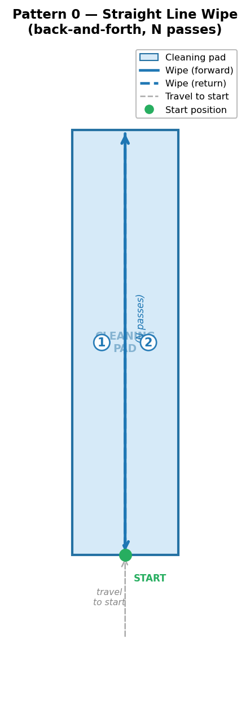
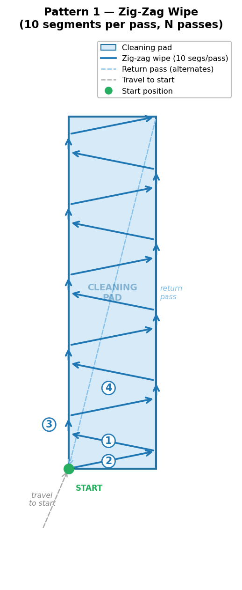
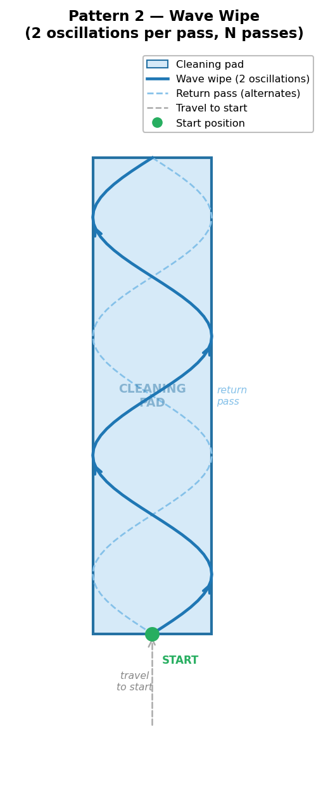
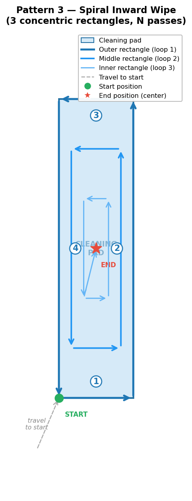
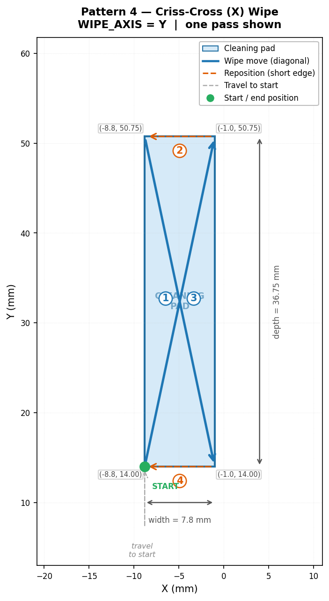

# NOZZLE_CLEAN User Guide (Klipper Macro)

Clean your nozzle by wiping it on a defined "pad" area on the bed (silicone brush, brass brush, scrub pad, etc.). This guide documents the macros and configuration files:

- `_NOZZLE_PARAMETERS` (behavior and default configuration variables — in `parameters.cfg`)
- `_NOZZLE_PAD` (pad geometry configuration variables — in `pad.cfg`)
- `NOZZLE_CLEAN` (run the cleaning routine)
- `NOZZLE_CLEAN_TEST` (safe dry-run: no heat, runs at Z=10)
- `NOZZLE_PAD_EDGE` (trace pad perimeter to validate geometry)
- `NOZZLE_PAD_Z` (display the calculated cleaning Z height)
- `NOZZLE_PAD_PATTERNS` (list available wipe patterns)

---

## Overview

### What this does
`NOZZLE_CLEAN`:
1. Optionally starts heating the nozzle (non-blocking).
2. Homes the printer if needed.
3. Moves above the cleaning pad area.
4. Waits for target temperature (if needed).
5. Optionally retracts filament slightly.
6. Drops to the calculated wipe height.
7. Wipes back and forth for a number of passes using the selected pattern.
8. Lifts to a safe Z and optionally turns the hotend off.
9. Restores prior gcode state.

### What you need
- A defined "pad" location on your bed where it is safe to wipe.
- Correct **pad geometry** values in `_NOZZLE_PAD` (`pad.cfg`).
- Correct **behavior settings** in `_NOZZLE_PARAMETERS` (`parameters.cfg`).
- A cleaning pad where the wipe height is set via the pad geometry (see [Pad geometry](#pad-geometry-mm)).

---

## Tips for Choosing a Pad Location

Placing the cleaning pad in the right spot is essential for reliable, safe operation. Consider the following when choosing a location.

### Reachability
- The pad must be within the reachable travel range of the toolhead on **all three axes**.
- After setting `variable_x`, `variable_y`, and the height variables in `pad.cfg`, use `NOZZLE_PAD_EDGE` to confirm the toolhead can actually reach all four corners of the pad without errors or unexpected motion.

### Avoid endstop and frame collisions
- Do **not** place the pad so close to an axis boundary that reaching it drives a motor to its hard end point.
- If your printer uses **physical endstop switches**, slamming the carriage into them during every cleaning cycle will wear them out prematurely.
- If your printer uses **sensorless (stallguard) homing**, driving the carriage into the frame to reach the pad can trigger false homing events or damage the frame and belt system.
- Leave a comfortable margin (typically ≥ 5 mm) between the pad position and the travel limits on every axis.

### Minimize impact on print area
- Place the pad **outside the primary print area** whenever possible — ideally at a corner or edge of the bed that is rarely used for printing.
- A pad mounted on the **front-left or front-right corner** of the bed is a common and practical choice, as it is easy to reach and does not consume usable print space.
- If the pad sits on the bed itself, account for its physical footprint when slicing: ensure the slicer's *print area* or *bed exclusion zone* is set so prints are never placed on or near the pad.

### Clear path during printing
- Confirm that **during a normal print**, neither the nozzle, fan ducts, nor any bed probe (BLTouch, CR Touch, Klicky, Beacon, etc.) will pass over or collide with the pad.
- Fan ducts and bed probes often extend beyond the nozzle tip in one or more directions — measure these offsets and verify clearance.
- Run a representative print (or simulate one in your slicer) and watch the toolhead path carefully to be sure it never approaches the pad location.
- If your printer performs an automatic bed-level or mesh-probe at the start of each print, verify that none of the probe points are positioned over the pad.

### Additional tips
- **Secure the pad firmly.** A pad that shifts or tilts mid-print can cause the nozzle to crash into it. Use adhesive, a mount, or clips to keep it in place.
- **Use a pad with low profile clearance.** A shorter pad reduces the risk that the toolhead will strike it accidentally during travel moves or probing.
- **Keep a thermal margin in mind.** Pads placed near the edge of a heated bed may receive residual heat. Choose a pad material that can withstand the temperatures typical at that location.
- **Document your pad coordinates.** Once you find a good position, record the `variable_x`, `variable_y`, and height values in a comment in `pad.cfg` so you can restore them quickly after a configuration reset.

---

## Installation

1. Copy all files from the `Nozzle-Clean` folder into a folder called `Nozzle-Clean` on your printer (e.g. alongside your `printer.cfg`):
   - `nozzle-clean.cfg`
   - `parameters.cfg`
   - `pad.cfg`
   - `Patterns/pattern0.cfg`
   - `Patterns/pattern1.cfg`
   - `Patterns/pattern2.cfg`
   - `Patterns/pattern3.cfg`
   - `Patterns/pattern4.cfg`

2. Include `nozzle-clean.cfg` from your `printer.cfg`:

   ```ini
   [include Nozzle-Clean/nozzle-clean.cfg]
   ```

3. Edit `Nozzle-Clean/pad.cfg` to match the position and dimensions of your cleaning pad.
4. Edit `Nozzle-Clean/parameters.cfg` to adjust behavior defaults if needed.
5. Restart Klipper.

---

## Quick Start

### Basic use
```gcode
NOZZLE_CLEAN
```

### Set a custom temperature and number of passes
```gcode
NOZZLE_CLEAN TEMP=210 PASSES=8
```

### Use the zig-zag pattern
```gcode
NOZZLE_CLEAN PATTERN=1
```

### Use the spiral inward pattern
```gcode
NOZZLE_CLEAN PATTERN=3
```

### Use the criss-cross pattern
```gcode
NOZZLE_CLEAN PATTERN=4
```

### Override wipe height for a single run
```gcode
NOZZLE_CLEAN Z=0.6
```

### Keep the hotend on when complete
```gcode
NOZZLE_CLEAN KEEP_HOTEND_ON=1
```

### Turn the hotend off when complete
```gcode
NOZZLE_CLEAN KEEP_HOTEND_ON=0
```

### Set retraction before cleaning
```gcode
NOZZLE_CLEAN TEMP=265 PASSES=8 KEEP_HOTEND_ON=1 RETRACT_DISTANCE=-2
```

---

## Configuration

### `_NOZZLE_PAD` (`pad.cfg`)

This macro stores all pad geometry as variables. It does **not** execute motion.

Edit these values to match the position and size of your cleaning pad.

#### Pad geometry (mm)
| Variable | Meaning |
|---|---|
| `variable_x` | X position of the pad's minimum corner (can be negative) |
| `variable_y` | Y position of the pad's minimum corner (can be negative) |
| `variable_width` | Pad size in X (left-to-right, must be positive) |
| `variable_depth` | Pad size in Y (front-to-back, must be positive) |
| `variable_base_height` | Height of the solid base portion of the pad — the nozzle should not drop below this point |
| `variable_brush_height` | Height of the brush/wiper portion above the base |
| `variable_nozzle_height` | The exposed portion of the nozzle tip that needs cleaning |
| `variable_z` | Vertical offset of the pad from the build plate (0 = on the plate, negative = below, positive = above) |

> **Tip:** `variable_x` and `variable_y` define the **minimum corner** of the pad. `variable_width` and `variable_depth` extend positively from that corner.

> **Wipe Z is calculated automatically** from the pad geometry:
> - If `nozzle_height > brush_height`: `wipe_z = base_height + z` (nozzle fully enters the brush)
> - Otherwise: `wipe_z = base_height + brush_height - nozzle_height + z` (nozzle tip is submerged by the full `nozzle_height` into the brush)
>
> Use `NOZZLE_PAD_Z` to display the calculated value before wiping.

### `_NOZZLE_PARAMETERS` (`parameters.cfg`)

This macro stores behavior settings and defaults as variables. It does **not** execute motion.

#### Behavior
| Variable | Meaning |
|---|---|
| `variable_safe_z` | Travel Z height (absolute) used before/after wiping — must be above the pad |
| `variable_travelxy_f` | XY travel feedrate (mm/min) |
| `variable_travelz_f` | Z travel feedrate (mm/min) |
| `variable_wipe_f` | Wipe feedrate (mm/min) |

#### Defaults
| Variable | Meaning |
|---|---|
| `variable_default_temp` | Default cleaning temperature if `TEMP` not provided |
| `variable_default_passes` | Default number of wipe passes |
| `variable_default_keep_hotend_on` | `1` keep hotend on, `0` turn hotend off |
| `variable_default_retract_distance` | Default filament retract distance before cleaning (negative = retract) |
| `variable_default_retract_f` | Default retraction feedrate (mm/min) |
| `variable_default_wipe_pattern` | Default wipe pattern (`0` = straight line, `1` = zig-zag, `2` = wave, `3` = spiral inward, `4` = criss-cross) |
| `variable_always_heat` | `True` always heat/wait to `TEMP`; `False` only heat/wait if below `(TEMP-2)` |

---

## Wipe Patterns

| Pattern | Value | Description |
|---|---|---|
| Straight Line | `0` | Wipes back and forth in a straight line along the long axis of the pad |
| Zig-Zag | `1` | Wipes in a zig-zag pattern covering the full pad area |
| Wave | `2` | Wipes in a sinusoidal wave pattern along the long axis of the pad |
| Spiral Inward | `3` | Traces concentric rectangles starting from the pad edge, stepping inward each loop until the center is reached |
| Criss-Cross | `4` | Traces two diagonals across the pad forming an X shape, crossing the long side on each arm |

### Pattern Diagrams

| Pattern 0 — Straight Line | Pattern 1 — Zig-Zag |
|:---:|:---:|
|  |  |

| Pattern 2 — Wave | Pattern 3 — Spiral Inward |
|:---:|:---:|
|  |  |

| Pattern 4 — Criss-Cross |
|:---:|
|  |

The wipe axis (X or Y) is **automatically determined** from the pad geometry:
- If `variable_depth > variable_width`: wipes in the **Y** direction
- If `variable_width > variable_depth`: wipes in the **X** direction
- If `variable_width == variable_depth`: an error is raised (pad must be rectangular, not square)

---

## Command Reference

### `NOZZLE_CLEAN`

Clean the nozzle using the configured pad.

#### Parameters
| Parameter | Type | Default | Description |
|---|---|---|---|
| `TEMP` | int | `default_temp` | Nozzle cleaning temperature in °C (`0` = no heating) |
| `PASSES` | int | `default_passes` | Number of wipe passes |
| `PATTERN` | int | `default_wipe_pattern` | Wipe pattern (`0` = straight line, `1` = zig-zag, `2` = wave, `3` = spiral inward, `4` = criss-cross) |
| `Z` | float | calculated from pad geometry | Override wipe height (absolute Z) for this run |
| `KEEP_HOTEND_ON` | int (0/1) | `default_keep_hotend_on` | Keep nozzle hot afterward (1) or turn off (0) |
| `RETRACT_DISTANCE` | float | `default_retract_distance` | Override filament retract distance (negative = retract) |
| `RETRACT_F` | float | `default_retract_f` | Override retraction feedrate (mm/min) |

#### Behavior details
- **State safety:** Uses `SAVE_GCODE_STATE` / `RESTORE_GCODE_STATE` to preserve modes/settings.
- **Homing:** If `printer.toolhead.homed_axes != "xyz"`, it runs `G28`.
- **Positioning:** Uses `G90` (absolute moves).
- **Wipe axis:** Automatically determined from pad dimensions (see [Wipe Patterns](#wipe-patterns)).
- **Wipe Z:** Calculated from pad geometry unless overridden with `Z`.
- **Heating logic:**
  - If `always_heat=True`: always `M104` then always `M109`.
  - If `always_heat=False`: heat/wait only if current temp is below `(TEMP - 2)`.
- **Retraction:** If `TEMP > 0`, the nozzle is retracted by `RETRACT_DISTANCE` at `RETRACT_F` before wiping.

#### Example
```gcode
NOZZLE_CLEAN TEMP=205 PASSES=6 KEEP_HOTEND_ON=1
NOZZLE_CLEAN PATTERN=1 TEMP=265 PASSES=8 KEEP_HOTEND_ON=1 RETRACT_DISTANCE=-2
NOZZLE_CLEAN PATTERN=3 TEMP=210 PASSES=3 KEEP_HOTEND_ON=1
```

---

### `NOZZLE_CLEAN_TEST`

Dry-run of `NOZZLE_CLEAN` without heating and with the nozzle held at Z=10 (well above the pad).

#### What it does
- Calls `NOZZLE_CLEAN TEMP=0 KEEP_HOTEND_ON=0 Z=10`.
- No heating occurs and the nozzle will not touch the pad.

#### Usage
```gcode
NOZZLE_CLEAN_TEST
```

> Note: This is intended to validate motion/pathing safely. Still ensure the pad area is clear.

---

### `NOZZLE_PAD_EDGE`

Traces the pad perimeter (optionally inset) to validate pad geometry and positioning.

#### Parameters
| Parameter | Type | Default | Description |
|---|---|---|---|
| `PASSES` | int | `default_passes` | Number of perimeter loops |
| `INSET` | float | `0.0` | Inset from pad edges (mm) |
| `Z` | float | `base_height + brush_height + z + 3` | Z height to trace at (absolute) |

#### Usage
Trace exact pad perimeter:
```gcode
NOZZLE_PAD_EDGE
```

Trace an inset perimeter:
```gcode
NOZZLE_PAD_EDGE PASSES=3 INSET=2
```

Lower it to contact the pad (be careful):
```gcode
NOZZLE_PAD_EDGE PASSES=2 INSET=1 Z=0.6
```

#### Validation checks
`NOZZLE_PAD_EDGE` will error if:
- `PASSES < 1`
- `INSET < 0`
- `INSET` is too large for the pad size (`(width - 2*inset) <= 0` or `(depth - 2*inset) <= 0`)
- `variable_safe_z` is below the pad height (`base_height + brush_height`)

---

### `NOZZLE_PAD_Z`

Displays the calculated Z height that will be used when cleaning the nozzle.

#### Usage
```gcode
NOZZLE_PAD_Z
```

#### What it does
- Reads `_NOZZLE_PAD` geometry variables and calculates the optimal wipe Z height.
- Reports the result via `RESPOND` (visible in the console).
- Also warns if `variable_safe_z` is below the pad height.

---

### `NOZZLE_PAD_PATTERNS`

Displays a list of all available wipe patterns by name.

#### Usage
```gcode
NOZZLE_PAD_PATTERNS
```

#### What it does
- Calls `_WIPE_PATTERN_NAME_0`, `_WIPE_PATTERN_NAME_1`, `_WIPE_PATTERN_NAME_2`, `_WIPE_PATTERN_NAME_3`, and `_WIPE_PATTERN_NAME_4` to print the name of each supported pattern via `RESPOND` (visible in the console).

---

## How pad targeting works

The wipe axis is automatically selected based on which pad dimension is larger.

For **Pattern 0 (Straight Line)**:
- The nozzle moves to the center of the non-wipe axis and wipes back/forth along the full length of the wipe axis.
- If wiping in **X**: moves to `Y = pad_y + (pad_depth / 2)`, wipes between `pad_x` and `pad_x + pad_width`.
- If wiping in **Y**: moves to `X = pad_x + (pad_width / 2)`, wipes between `pad_y` and `pad_y + pad_depth`.

For **Pattern 1 (Zig-Zag)**:
- The nozzle starts at the pad's minimum corner and sweeps diagonally across the pad surface in 10 steps per pass, reversing direction each pass to cover the full pad area.

For **Pattern 3 (Spiral Inward)**:
- The nozzle traces `variable_loop_count` concentric rectangles spiraling inward, stopping one step short of center. After all loops complete, the nozzle moves to the center of the pad to finish the pass. This pattern is repeated for each pass.
- This pattern covers the entire pad surface regardless of which axis is longer.

For **Pattern 4 (Criss-Cross)**:
- The nozzle starts at the pad's minimum corner `(pad_x, pad_y)` and traces an X shape across the full pad each pass:
  1. Diagonal to the opposite corner, crossing the long side.
  2. Move to the adjacent corner along the short edge.
  3. Diagonal back across the long side to the opposite corner.
  4. Return to `(pad_x, pad_y)` along the short edge, completing the X.
- This pattern covers the entire pad surface with two full diagonal strokes per pass.

---

## Recommended setup workflow

1. **Display the calculated wipe Z**
   - Run:
     ```gcode
     NOZZLE_PAD_Z
     ```
   - Verify the calculated height matches your expectations before running a real clean.

2. **Start with safe Z testing**
   - Run:
     ```gcode
     NOZZLE_PAD_EDGE Z=10
     ```
   - Confirm the toolhead traces the correct rectangle above the pad.

3. **Dial in pad geometry**
   - Adjust `variable_x`, `variable_y`, `variable_width`, `variable_depth` in `pad.cfg` until the trace aligns.

4. **Verify the wipe height**
   - Set `variable_base_height`, `variable_brush_height`, and `variable_nozzle_height` in `pad.cfg` to match your physical pad and nozzle.
   - The macro calculates the wipe Z automatically — use `NOZZLE_PAD_Z` to confirm.

5. **Run a dry test**
   - Run:
     ```gcode
     NOZZLE_CLEAN_TEST
     ```
   - Confirm the motion path is correct without touching the pad.

6. **Run a real cleaning**
   - Example:
     ```gcode
     NOZZLE_CLEAN TEMP=200 PASSES=5 KEEP_HOTEND_ON=1
     ```

---

## Running on Every Print

To automatically clean the nozzle before each print, add the `NOZZLE_CLEAN` call to your print start sequence. The ideal location is **right after `M109 S{EXTRUDER_TEMP}`** (wait for extruder temperature) and **before drawing the purge line**.

Pass `TEMP={EXTRUDER_TEMP}` so the macro uses the correct printing temperature, and use `KEEP_HOTEND_ON=1` to keep the nozzle hot for the purge line that follows.

### Option 1: In the slicer start G-code

Add `NOZZLE_CLEAN` directly in your slicer's custom start G-code, right after the wait-for-temperature line:

```gcode
; heat commands ...
M109 S{EXTRUDER_TEMP}                               ; wait for extruder temperature
NOZZLE_CLEAN TEMP={EXTRUDER_TEMP} KEEP_HOTEND_ON=1 ; clean the nozzle
; draw purge line ...
```

> **Note:** The placeholder variable name depends on your slicer:
> - PrusaSlicer / SuperSlicer / OrcaSlicer: `{first_layer_temperature[0]}` or `{temperature[0]}`
> - Cura: `{material_print_temperature_layer_0}`
>
> Replace `{EXTRUDER_TEMP}` above with the correct placeholder for your slicer.

### Option 2: In the `START_PRINT` Klipper macro

If your slicer calls a Klipper `START_PRINT` macro (e.g., `START_PRINT EXTRUDER_TEMP=210 BED_TEMP=60`), add the `NOZZLE_CLEAN` call inside that macro, after the wait-for-temperature line and before drawing the purge line:

```ini
[gcode_macro START_PRINT]
gcode:
  
  ; ... other setup commands ...
  M109 S{EXTRUDER_TEMP}                               ; wait for extruder temperature
  NOZZLE_CLEAN TEMP={EXTRUDER_TEMP} KEEP_HOTEND_ON=1 ; clean the nozzle
  ; ... draw purge line ...
```

> **Tip:** `KEEP_HOTEND_ON=1` ensures the nozzle stays at printing temperature so the purge line extrudes correctly right after cleaning.

---

## Safety notes

- Verify the pad area is clear and the nozzle won't collide with clips, magnets, bed screws, or printed parts.
- Ensure `variable_safe_z` in `parameters.cfg` is set above the top of the pad (`base_height + brush_height`).
- Use conservative speeds and higher Z while testing.
- If your cleaning pad is abrasive (e.g., brass brush), ensure your wipe height won't bend mounts or overload the toolhead.

---

## Troubleshooting

### "It wipes in the wrong direction"
- The wipe axis is auto-detected: if `variable_depth > variable_width` the macro wipes in Y; if `variable_width > variable_depth` it wipes in X.
- Adjust your `variable_width` and `variable_depth` in `pad.cfg` to reflect your pad's actual orientation.

### "It doesn't heat sometimes"
- If `variable_always_heat` is `False`, the macro only heats/waits when below `(TEMP - 2)`.
- Set `variable_always_heat: True` if you want consistent heating behavior.

### "It's not wiping on the pad"
- Use `NOZZLE_PAD_EDGE` to validate geometry and location.
- Re-check `variable_x`, `variable_y`, `variable_width`, `variable_depth` in `pad.cfg`.
- Confirm your coordinate system and bed origin match your assumptions.

### "It's too aggressive / too slow"
- Adjust:
  - `variable_wipe_f` (wipe speed)
  - `variable_travelxy_f` / `variable_travelz_f` (travel speed)
  - `PASSES` (number of wipes)

### "Error: variable_safe_z is below the pad height"
- Increase `variable_safe_z` in `parameters.cfg` so it is above `base_height + brush_height`.

---

## Changelog

- **v1.2.1** (Last Updated: 2026-04-04)
  - Added Pattern 4 (Criss-Cross): traces two full diagonals across the pad forming an X shape per pass (`Patterns/pattern4.cfg`).

- **v1.2.0** (Last Updated: 2026-04-01)
  - Added Pattern 3 (Spiral Inward): traces concentric rectangles from the pad edge inward to the center (`Patterns/pattern3.cfg`).
  - Added `variable_loop_count` to `_WIPE_PATTERN_PARAMETERS_3` to control the number of concentric rectangle loops per pass.

- **v1.1.1** (Last Updated: 2026-03-29)
  - Added Pattern 2 (Wave): sinusoidal wave wipe pattern (`Patterns/pattern2.cfg`).
  - Added `variable_z` to `_NOZZLE_PAD` (`pad.cfg`) to support pads mounted above or below the build plate.
  - Wipe Z calculation now incorporates `variable_z` offset.
  - Added `NOZZLE_PAD_PATTERNS` macro to list all available wipe patterns.

- **v1.1.0** (Last Updated: 2026-03-28)
  - Separated configuration into `parameters.cfg` (`_NOZZLE_PARAMETERS`) and `pad.cfg` (`_NOZZLE_PAD`).
  - Wipe Z height is now calculated automatically from pad geometry (`base_height`, `brush_height`, `nozzle_height`).
  - Wipe axis is now auto-detected based on pad dimensions (no longer a config variable).
  - Added `PATTERN` parameter (0 = straight line, 1 = zig-zag).
  - Added `RETRACT_DISTANCE` and `RETRACT_F` parameters for filament retraction before wiping.
  - Added `NOZZLE_PAD_Z` macro to display the calculated cleaning Z height.
  - Added separate XY and Z travel feedrates (`variable_travelxy_f`, `variable_travelz_f`).
  - Added `variable_default_wipe_pattern` and `variable_default_retract_distance` / `variable_default_retract_f` config variables.
  - Updated `NOZZLE_CLEAN_TEST` to run at a fixed `Z=10`.
  - Updated `NOZZLE_PAD_EDGE` default Z to `base_height + brush_height + 3` (auto-calculated).

- **v1.0.0** (Last Updated: 2026-02-27)
  - Initial release.

---

## License / Attribution

Written by **Daniel Porrey**.
Feel free to include this guide in your GitHub repository alongside the macro.
